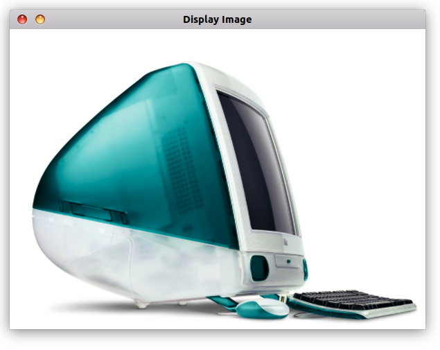
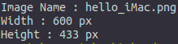

# Sample code for Image Processing using OpenCV and C++

## Build project

```
git clone <this_repository>
cd <folder>
make
./DisplayImage
```

You should see this : 




and this in terminal :




## Install OpenCV on Linux

0 - créate sample code for tests : 
 
```cpp
#include <iostream>
#include <opencv2/opencv.hpp>
#include <opencv2/highgui.hpp>

using namespace std;

int main()
{
    cv::Mat image;
    image = cv::imread("images/hello_iMac.png", 1);
 
    cv::namedWindow("Display Image", cv::WINDOW_AUTOSIZE);
    cv::imshow("Display Image", image);
    cv::waitKey(0);
    return 0;
}
```
 
1- Install dependencies:

```bash
sudo apt-get update sudo apt-get upgrade sudo apt-get install libgtk2.0-dev pkg-config
```

2- To compile OpenCV you will need a C++ compiler. Usually it is G++/GCC or Clang/LLVM. also OpenCV uses CMake build configuration tool:

```bash
sudo apt install -y g++ sudo apt-get install cmake make
```

3- Clone repository using git:
 
```bash
git clone https://github.com/opencv/opencv.git 
git clone https://github.com/opencv/opencv_contrib.git
```

4- Create build directory:

```bash
mkdir -p build && cd build
```

5- Configure-generate build scripts for the preferred build system:
 
```bash
cmake -DOPENCV_EXTRA_MODULES_PATH=../opencv_contrib/modules ../opencv
```

6- Build-run actual compilation process. 4 is number of used processor cores. this part may takes some minutes.

```bash
make -j4
```
 
7- Installation process copies files to predefined locations and do minor patching:

```bash
sudo make install
```
 
7.1- You can remove opencv if you want:

```bash
sudo make uninstall
```
 
8- Create a CMake file (CMakeLists.txt) . the name of the source code is DisplayImage.cpp for example:
 
```
cmake_minimum_required(VERSION 2.8)
project( DisplayImage )
find_package( OpenCV REQUIRED )
include_directories( ${OpenCV_INCLUDE_DIRS} )
add_executable( DisplayImage main.cpp )
target_link_libraries( DisplayImage ${OpenCV_LIBS} )
```

9- Generate the executable. This part is easy, just proceed as with any other project 
using CMake:

```bash
cd <DisplayImage_directory> cmake . make
```
 
10- run executable file:

```bash
./DisplayImage
```

11 - enjoy ;)
